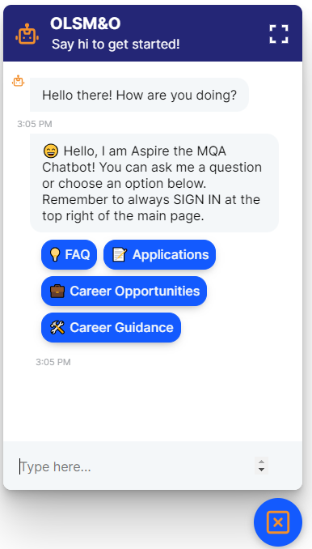
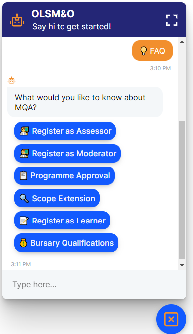
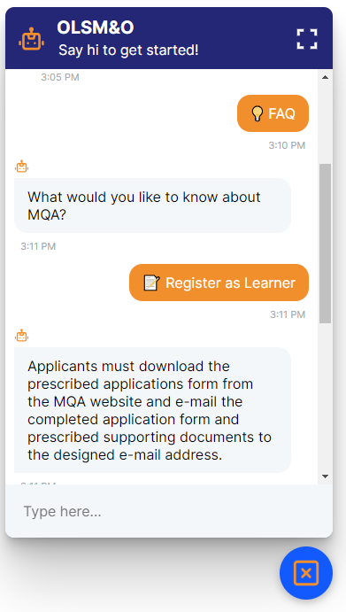

# Rasa NLU Chatbot for Online Learner Skills Matrix & Qualifications Portal

## Overview

The Rasa NLU chatbot is designed for the Online Learner Skills Matrix & Qualifications Portal, which is a part of the Mining Qualifications Authority (MQA). The MQA engages with various stakeholders, including learners, providers, employers, partners, practitioners, quality councils, and other bodies. This portal aims to facilitate learners in the mining sector, or those interested in it, by providing various services and resources.

## Objectives

The primary objective of the portal is to enable learners to:
- Register on the portal and indicate their skills and qualifications.
- Upload their CVs.
- View training, bursary, learnership, and internship opportunities in the mining sector.
- Receive relevant news and updates.
- Connect with prospective employers.
- Access links to resources and information.

## Chatbot Features

The chatbot assists learners in:
- Getting information about the portal.
- Navigating the various features and services offered.
- Viewing and applying for training programs, bursaries, learnerships, and internships.

## Project Steps

### Chatbot Development

We are using Rasa NLU to develop the chatbot. The chatbot will assist users in navigating the portal and accessing the various features and services offered.

### Training, Bursary, and Internship Opportunities

The chatbot will provide information on available training programs, bursaries, learnerships, and internships in the mining sector. Users can view and apply for these opportunities through the portal.

## Usage

To run the project locally or contribute, follow these steps:

1. **Clone the repository**:
    ```bash
    git clone https://github.com/username/JobPortal_Chatbot.git
    ```

2. **Navigate to the project directory**:
    ```bash
    cd JobPortal_Chatbot
    ```

3. **Set up your Python environment and install dependencies**:
    ```bash
    pip install -r requirements.txt
    ```

4. **Create a virtual environment using Anaconda**:
    Since Rasa 3.0 supports only Python 3.8 and below:
    ```bash
    conda create -n venvr python=3.8
    conda activate venvr
    ```

5. **Install Rasa**:
    ```bash
    pip install rasa
    ```

6. **Run the chatbot**:
    ```bash
    rasa run --enable-api --cors "*"
    ```

7. **Open the chatbot in your web browser**:
    Open `index.html` in your browser to see the chatbot in action.

## Screenshots

Here are some screenshots of the chatbot in action:




